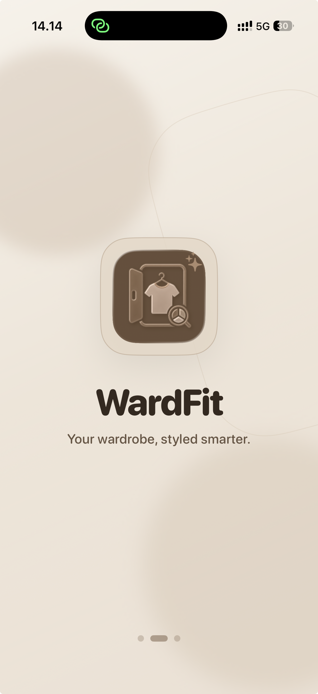
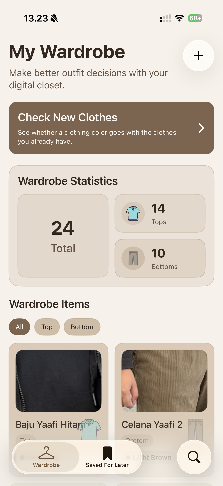
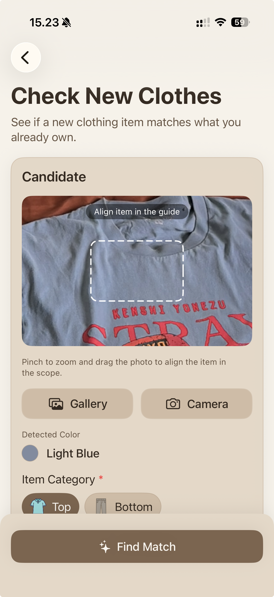
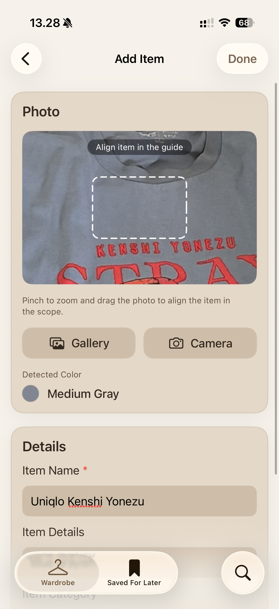
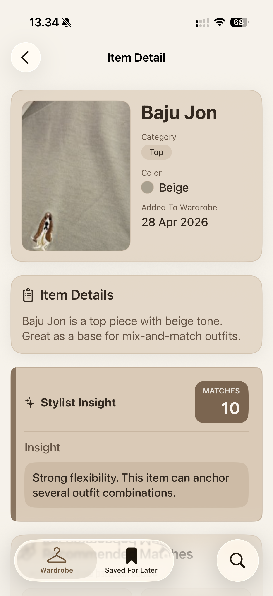
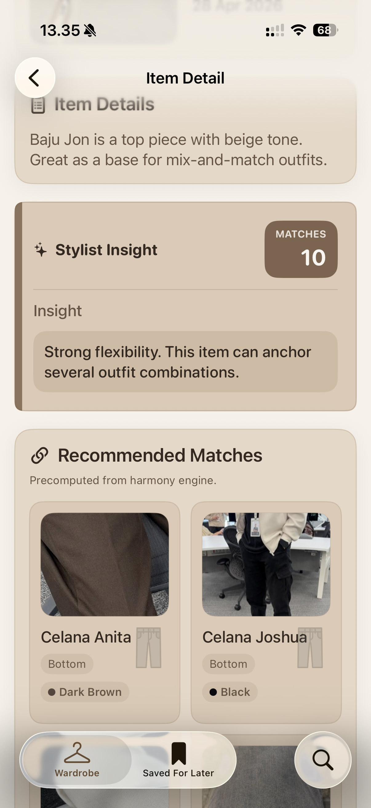

# WardFit

WardFit is an application that helps users make smarter clothing purchase decisions by analyzing color compatibility between new items and the clothes already in their wardrobe. The app recommends outfit combinations based on color harmony, allowing users to determine whether a new item fits their existing style before buying it.

## 🧠 Background

People often struggle to decide whether a clothing item is worth purchasing because they are unsure if its color will match the clothes they already own. Most shopping experiences focus only on the appearance of the product itself, without considering how well it integrates with the user’s existing wardrobe.

WardFit addresses this problem by helping users digitally organize their wardrobe and analyze the compatibility of new clothing items. By using color harmony principles, the app provides outfit recommendations that make purchasing decisions more practical and confident.

## ✨ Features / Key Features

### 👕 Digital Wardrobe
Store and organize clothing items digitally by categorizing them based on clothing type.

### 📷 Clothes Scanner
Scan clothing items using the device camera or uploaded images, then extract dominant colors to find matching items from the user’s wardrobe.

### 🎨 Color Harmony-Based Recommendation
Recommend outfit combinations based on opposite clothing types (e.g., tops and bottoms) and color harmony principles.

## 🛠 Tech Stack
- SwiftUI
- SwiftData
- AVFoundation
- CoreGraphics

<!-- ## 🚀 Installation
```bash
git clone https://github.com/username/wardfit.git
cd wardfit
open WardFit.xcodeproj -->

## 📷 Screenshots
<div style="display: flex; gap: 16px; flex-wrap: wrap; justify-content: center;">
    
    
    
    
    
    
</div>
